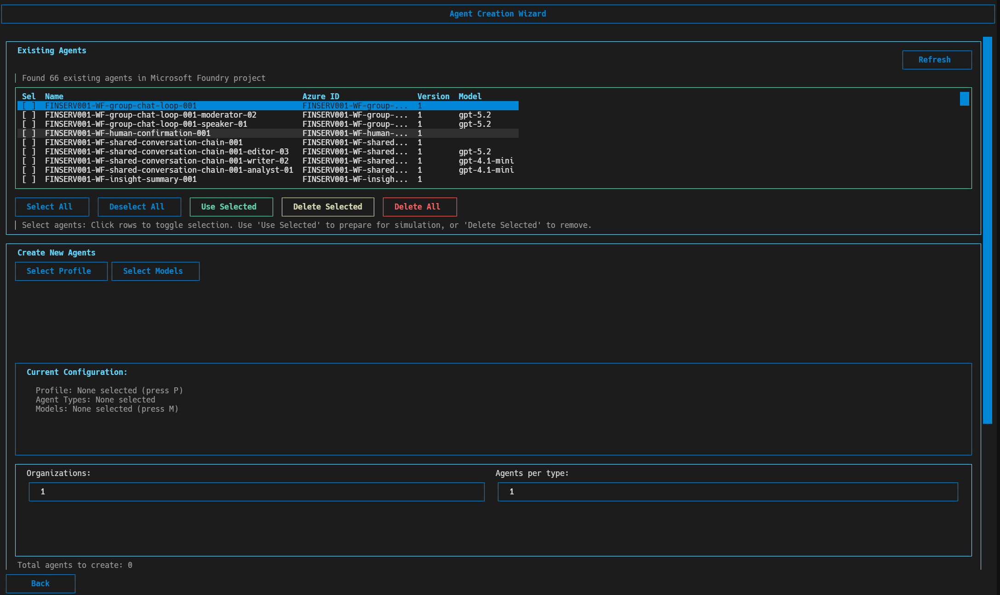
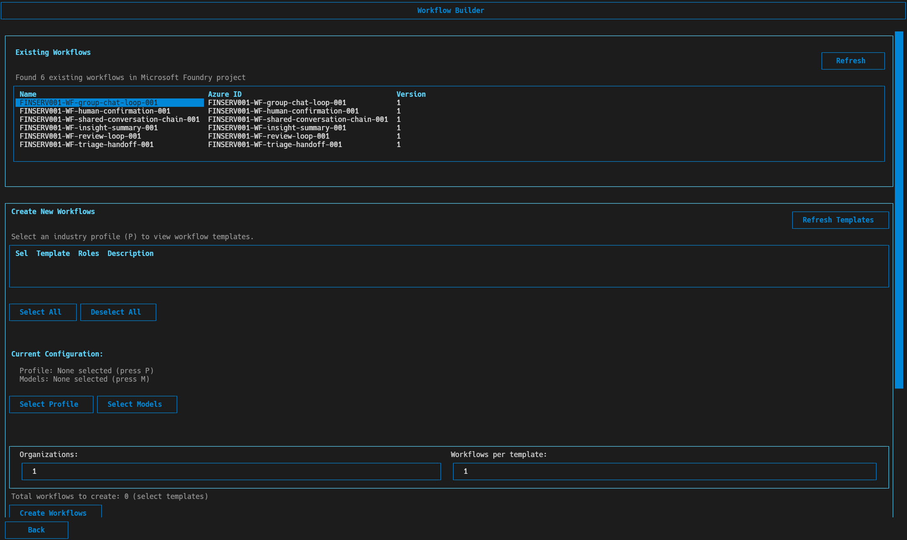
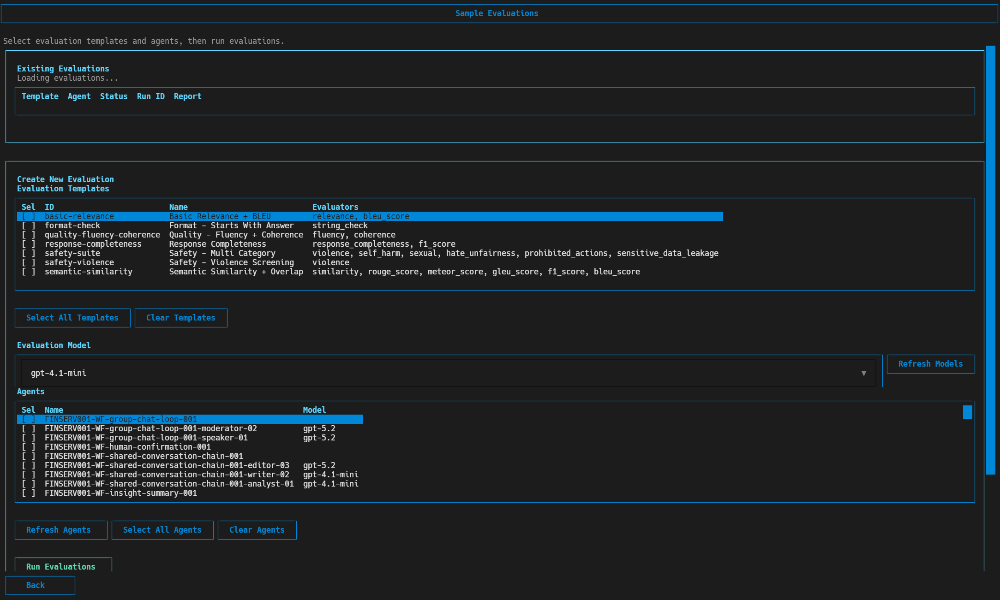
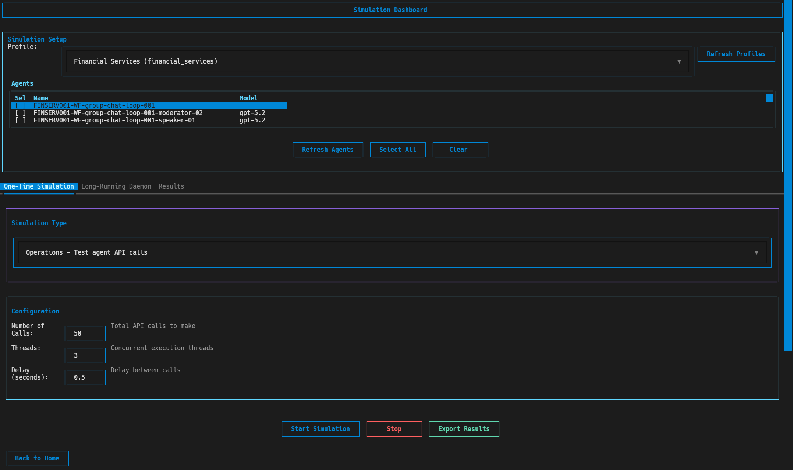

# Microsoft Foundry Bootstrap

A comprehensive toolkit for batch creation, testing, and management of AI agents at scale using Microsoft Foundry Control Plane features. Supports industry-specific templates, parallel agent operations, and real-time metrics collection through both a modern **Web UI** and an intuitive **Terminal UI**.

## Screenshots


| Agents | Workflows |
|---|---|
|  |  |

| Evaluations | Simulate |
|---|---|
|  |  |

## Features

- **Dual Interface**: Choose between modern Web UI (React) or Terminal UI (Textual) based on your preference
- **Batch Agent Operations**: Create and manage 100+ AI agents simultaneously with multi-threaded processing
- **Industry Templates**: Pre-configured profiles for Retail, Financial Services, Healthcare, Manufacturing, Logistics & Transportation, Energy & Utilities, and Telecommunications with specialized agent types
- **Model Management**: Discover existing models and deploy new ones through Microsoft Foundry Control Plane
- **Workflow Management**: Create and manage multi-agent workflows with configurable patterns
- **Real-time Simulation**: Run continuous daemon simulations with live metrics and progress tracking
- **Code Generation**: Automatically generate production-ready simulation scripts from templates
- **Metrics & Visualization**: Real-time performance tracking with interactive charts and dashboards
- **Agent Registry**: Centralized tracking of created agents with CSV-based persistence
- **Sample Evaluations**: Run reusable evaluation templates against selected agents using Foundry evaluation APIs

## User Interfaces

### Web UI (Recommended)

A modern, responsive web interface built with React, TypeScript, and Tailwind CSS.

**Features:**
- Visual dashboard with real-time status updates
- Interactive charts for simulation metrics
- Drag-and-drop workflows (coming soon)
- Progress tracking with live updates
- Dark mode support

**Starting the Web UI:**

```bash
# Start both API and frontend together
./start_all.sh

# Or start separately:
python start_api.py          # API server on http://localhost:8000
./start_frontend.sh          # Frontend on http://localhost:5173
```

**Navigation:**
- **Dashboard** - Overview of models, agents, workflows, and daemon status
- **Templates** - Browse and explore industry templates
- **Agents** - Create and manage AI agents with progress tracking
- **Workflows** - Create multi-agent workflows
- **Simulation** - Run one-time simulations or start continuous daemon
- **Evaluations** - Run evaluation templates against agents
- **Settings** - View models, connection status, and theme settings

### Terminal UI (TUI)

A powerful command-line interface built with Textual for terminal-based management.

**Features:**
- Full keyboard navigation
- ASCII-based visualizations
- Works over SSH
- Low resource usage
- Scriptable operations

**Starting the Terminal UI:**

```bash
# Launch Terminal UI (default)
python main.py

# Or explicitly
python main.py tui
```

**Terminal UI Screens:**
- Main dashboard with agent/workflow counts
- Agent creation with template selection
- Model discovery and management
- Workflow creation
- Simulation runner
- Evaluation templates

### CLI Commands (No UI)

For automation and scripting:

```bash
# List available templates
python main.py list

# Create agents from template
python main.py create retail -n 2 --orgs 3 -y

# Generate simulation code
python main.py generate retail -o output/retail_code
```

## Quick Start

### Prerequisites

- Python 3.10+
- Node.js 18+ (for Web UI)
- Azure CLI
- Microsoft Foundry project with endpoint

### Setup

```bash
# 1. Create and activate virtual environment
python -m venv .venv
source .venv/bin/activate  # Linux/Mac
# .venv\Scripts\activate   # Windows

# 2. Install Python dependencies
pip install -r requirements.txt

# 3. Install frontend dependencies (for Web UI)
cd frontend
npm install
cd ..

# 4. Authenticate with Azure CLI (required for all operations)
az login

# 5. Configure environment
cp .env.example .env
# Edit .env and set your PROJECT_ENDPOINT
```

### Launch Options

**Option 1: Web UI (Recommended)**
```bash
./start_all.sh
# Access at http://localhost:5173
# API docs at http://localhost:8000/docs
```

**Option 2: Terminal UI**
```bash
python main.py
```

**Option 3: CLI Commands**
```bash
python main.py list                    # List templates
python main.py create retail -n 2 -y   # Create agents
```

## Project Structure

```
.
├── main.py                 # CLI entry point
├── start_api.py           # FastAPI server startup
├── start_frontend.sh      # React frontend startup
├── start_all.sh           # Start both services
├── requirements.txt        # Python dependencies
├── .env.example           # Environment template
│
├── src/                  # Core library
│   ├── api/             # FastAPI backend
│   │   ├── main.py            # FastAPI app
│   │   ├── routers/           # API route modules
│   │   ├── schemas/           # Request/response models
│   │   └── websocket.py       # WebSocket manager
│   ├── core/            # Business logic
│   │   ├── azure_client.py
│   │   ├── agent_manager.py
│   │   ├── workflow_manager.py
│   │   ├── model_manager.py
│   │   ├── evaluation_engine.py
│   │   ├── simulation_engine.py
│   │   └── daemon_service.py
│   ├── models/          # Pydantic models
│   ├── templates/       # Template utilities
│   └── codegen/         # Code generation
│
├── frontend/            # React Web UI
│   ├── src/
│   │   ├── components/        # Reusable UI components
│   │   ├── pages/            # Page components
│   │   ├── lib/              # API client and utilities
│   │   └── types/            # TypeScript types
│   ├── package.json
│   └── ...
│
├── templates/            # Industry templates
│   ├── industries/      # YAML profiles
│   │   ├── retail.yaml
│   │   ├── financial_services.yaml
│   │   ├── healthcare.yaml
│   │   └── manufacturing.yaml
│   └── code/            # Jinja2 templates
│
├── evaluation-templates/ # Sample evaluation templates (YAML)
│
└── ui/                   # Terminal UI
    ├── terminal/        # Textual TUI
    └── shared/          # Shared state
```

## Industry Templates

| Industry | Agent Types |
|----------|-------------|
| **retail** | CustomerSupport, CatalogEnrichment, PricingOptimization, SupplyChain, MarketingCopy |
| **financial_services** | FraudDetection, RiskAssessment, ComplianceReview, CustomerService, PortfolioAnalysis |
| **healthcare** | PatientIntake, ClinicalDecisionSupport, BillingAssistant, AppointmentScheduler |
| **manufacturing** | QualityControl, PredictiveMaintenance, SupplyChainOptimizer, SafetyCompliance |
| **logistics_transportation** | DispatchCoordinator, RouteOptimizer, FleetManager, ShipmentTracking |
| **energy_utilities** | GridDispatcher, OutageCoordinator, LoadForecaster, MarketOperations |
| **telecommunications** | NetworkMonitoring, IncidentManager, ProvisioningSpecialist, FraudPrevention |

## API Endpoints

The FastAPI backend provides REST and WebSocket endpoints:

### REST API

- `GET /api/status` - System status
- `GET /api/models` - List available models
- `GET /api/templates` - List industry templates
- `GET /api/agents` - List agents
- `POST /api/agents` - Create agents
- `DELETE /api/agents` - Delete all agents
- `GET /api/workflows` - List workflows
- `POST /api/workflows` - Create workflows
- `DELETE /api/workflows` - Delete all workflows
- `POST /api/simulations/start` - Start simulation
- `POST /api/daemon/start` - Start daemon
- `POST /api/daemon/stop` - Stop daemon
- `POST /api/evaluations/run` - Run evaluations

### WebSocket Endpoints

- `ws://localhost:8000/ws/simulation` - Real-time simulation updates
- `ws://localhost:8000/ws/daemon` - Real-time daemon metrics

**API Documentation:** http://localhost:8000/docs

## Environment Setup

Create `.env` from the example:

```env
PROJECT_ENDPOINT=https://your-project.services.ai.azure.com/api/projects/your-project
```

Authentication uses Azure CLI credentials via `DefaultAzureCredential`, so run `az login` before using the CLI or TUI.

## Usage Tips

### Web UI Best Practices

- **Dashboard**: Monitor real-time status of models, agents, workflows, and daemon
- **Progress Tracking**: All create/delete operations show live progress bars
- **Chart Styles**: Switch between dot, line, and curve styles in simulation charts
- **Dark Mode**: Toggle theme in Settings page
- **Deletion**: Use "Delete All" with caution - operations cannot be undone

### Terminal UI Navigation

- Use arrow keys or `j/k` to navigate
- `Tab` to switch between panels
- `Enter` to select
- `q` to quit most screens
- `Ctrl+C` to exit application

### Performance Considerations

- **Batch Operations**: Creating 100+ agents uses multi-threading for optimal performance
- **Daemon Mode**: Runs continuous simulations with configurable intervals (60s default)
- **Progress Callbacks**: Real-time updates don't significantly impact operation speed
- **WebSocket**: Efficient real-time updates without polling overhead

### Troubleshooting

**Authentication Issues:**
```bash
az login
az account show  # Verify correct subscription
```

**Port Conflicts:**
```bash
# Change ports in start_api.py or start_frontend.sh
uvicorn src.api.main:app --host 0.0.0.0 --port 8001
npm run dev -- --port 5174
```

**Frontend Build Issues:**
```bash
cd frontend
rm -rf node_modules package-lock.json
npm install
npm run dev
```

**Missing Dependencies:**
```bash
pip install -r requirements.txt --upgrade
cd frontend && npm install
```

## Development

### Running Tests

```bash
# API unit tests
pytest tests/unit/api/ -v

# All tests
pytest tests/ -v
```

### Project Commands

```bash
# Format code
black src/
isort src/

# Type checking
mypy src/

# Linting
ruff check src/
```

## License

[Your License Here]
